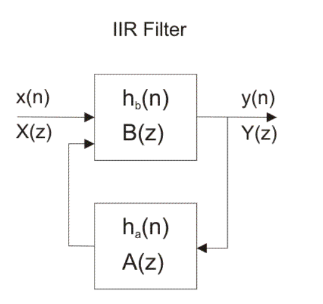
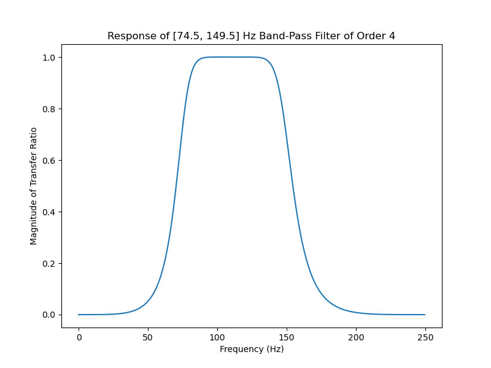
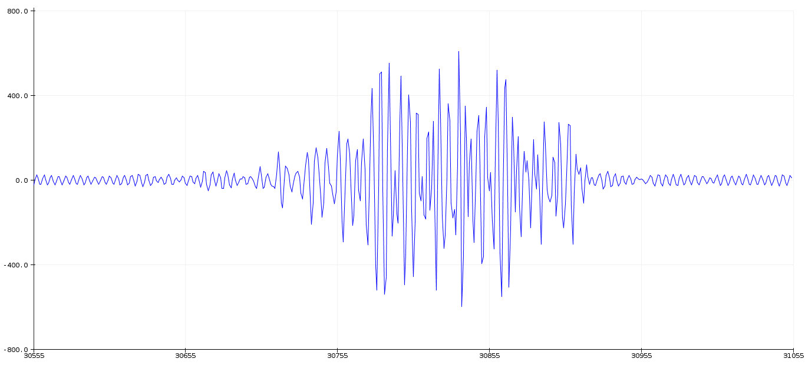

# EMG FILTERING

## Introduction

The surface electromyographic (sEMG) signal contains the signal that originates in the muscle and various noise components
which are endemic and unavoidable. These noise components contaminate the sEMG signal and may lead to an erroneous
interpretation of the signal making filtering an importance processes before cutting the long segment into short ones.

There are several toolboxes and methods for filtering electromyography (EMG) signals. Some of the commonly used toolboxes are:
1. Butterworth filter: It is a widely used low-pass filter that can be used to remove high-frequency noise from EMG signals. The Butterworth filter is a type of infinite impulse response (IIR) filter that can be implemented in Matlab or Python.
2. Wavelet transform: The wavelet transform is a time-frequency analysis tool that can be used to filter EMG signals. The wavelet transform can be used to decompose EMG signals into different frequency bands, which can then be filtered to remove noise.
3. Bandpass filter: A bandpass filter can be used to isolate the frequency band of interest in EMG signals. The bandpass filter can be designed to remove low and high-frequency noise while retaining the EMG signal of interest.
4. Adaptive filter: An adaptive filter is a type of digital filter that can be used to remove noise from EMG signals. The adaptive filter can be trained to learn the noise characteristics of the EMG signal and remove them in real-time.
5. Independent component analysis (ICA): ICA is a signal processing technique that can be used to separate independent sources of noise from EMG signals. ICA can be used to remove artifacts such as movement artifacts or electrical noise.
6. Kalman filter: The Kalman filter is a statistical method that can be used to estimate the underlying EMG signal while removing noise. The Kalman filter can be used to track the EMG signal in real-time and estimate the noise characteristics of the signal. and that uses digital filters to do the filtering.

**Block diagram of IIR filter** 

### Specifications of the implemented filter

1. *Passband frequency*= 74.5 Hz to 149.5 Hz
2. Also the sampling freqquency is 500 Hz
3. Biquad filter is used as a *bandpass filter*.

**Response of the filter**

**Filtered signal**

